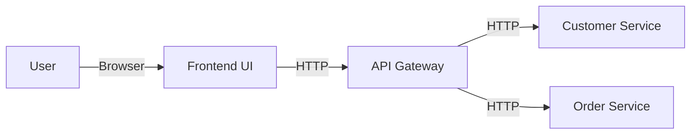

# OrderFlow

> **A simplified microservices reference architecture designed for local learning and experimentation.**

OrderFlow demonstrates the core patterns of a microservices architecture—**Service Decomposition**, **API Gateway**, and **Frontend integration**—without the complexity of container orchestration (Docker/Kubernetes). It is built to run natively on your local machine, making it the perfect sandbox for understanding how distributed systems communicate.

---

## 🏗️ Architecture

The application consists of four distinct components:



| Component | Technology | Port | Description |
|-----------|------------|------|-------------|
| **Frontend** | React, TypeScript, Vite | `5173` | A modern dashboard for managing customers and orders. |
| **API Gateway** | Python, FastAPI | `8000` | The single entry point. Routes requests to appropriate services. |
| **Customer Service** | Python, FastAPI | `8001` | Manages customer profiles. |
| **Order Service** | Python, FastAPI | `8002` | Manages order lifecycle. |

---

## ✨ Features

- **Microservices Pattern**: independent services with their own domains.
- **API Gateway Pattern**: Unified entry point for the frontend, handling request routing.
- **In-Memory Persistence**: No database setup required; data resets on restart for rapid prototyping.
- **Modern Stack**: Built with **FastAPI** (Python) and **React** (TypeScript).
- **Developer Friendly**: minimal configuration, hot-reloading enabled by default.

---

## 🚀 Getting Started

### Prerequisites
- **Python 3.9+**
- **Node.js 18+**

### Installation & Running

Since this is a distributed system, you will verify the "distributed" nature by running each service in its own terminal window.

#### 1. Start Customer Service
Manages customer data.
```bash
cd services/customer
pip install -r requirements.txt
uvicorn main:app --port 8001 --reload
```

#### 2. Start Order Service
Manages order data.
```bash
cd services/order
pip install -r requirements.txt
uvicorn main:app --port 8002 --reload
```

#### 3. Start API Gateway
Routes traffic to the backend services.
```bash
cd services/api-gateway
pip install -r requirements.txt
uvicorn main:app --port 8000 --reload
```

#### 4. Start Frontend
Launches the user interface.
```bash
cd frontend
npm install
npm run dev
```

---

## 🔌 API Reference

The **API Gateway** (Port 8000) is the only point of contact for the frontend.

- **Docs (Swagger UI)**: http://localhost:8000/docs
- **Health Check**: `GET /healthz`

### Endpoints
- `GET /api/customers` - List all customers
- `POST /api/customers` - Create a new customer
- `GET /api/orders` - List all orders
- `POST /api/orders` - Create a new order

---

## 📂 Project Structure

```
c:\Repos\order_flow
├── frontend/             # React + TypeScript UI
├── services/
│   ├── api-gateway/      # Routes requests to other services
│   ├── customer/         # Customer domain logic
│   └── order/            # Order domain logic
└── README.md             # This documentation
```
